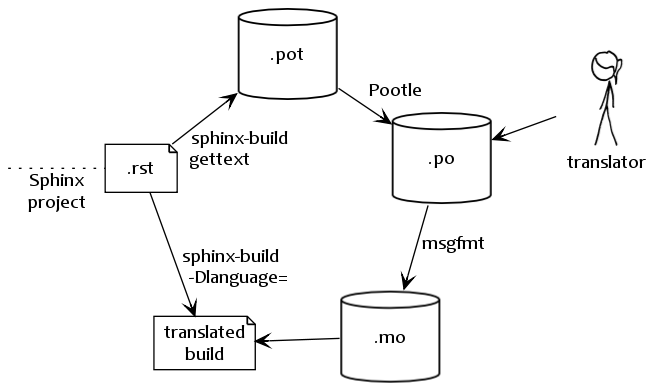

.. _intl:

国際化
======

.. Internationalization
   ====================

.. versionadded:: 1.1

.. Complementary to translations provided for Sphinx-generated messages such as
   navigation bars, Sphinx provides mechanisms facilitating *document* translations
   in itself.  See the :ref:`intl-options` for details on configuration.

Sphinxでは、ナビゲーションバーなどの文字列を各国語にする機能を提供していましたが、 **文章** そのものを翻訳する機能を提供します。細かい設定については :ref:`intl-options` を参照してください。

   Sphinxによる翻訳のビジュアルなワークフロー(人の絵は `XKCD comic <htt://xkcd.com/779/>`_ から借りました)

.. Workflow visualization of translations in Sphinx.  (The stick-figure is taken
   from an `XKCD comic <http://xkcd.com/779/>`_.)

.. **gettext** [1]_ is an established standard for internationalization and
   localization.  It naïvely maps messages in a program to a translated string.
   Sphinx uses these facilities to translate whole documents.

**gettext** [1]_ は国際化とローカル化の手段として、良く使用されている方法です。プログラム中で使用されるメッセージと、翻訳文字列の対応表を使って置き換えてきます。Sphinxはこの機能を使って、ドキュメント全体を翻訳していきます。

.. Initially project maintainers have to collect all translatable strings (also
   referred to as *messages*) to make them known to translators.  Sphinx extracts
   these through invocation of ``sphinx-build -b gettext``.

まず最初に、プロジェクトのメンテナーはすべての翻訳文字列を集めてくる必要があります(これを **メッセージ** と呼ぶ)。これを翻訳者に渡します。Sphinxでは、 ``sphinx-build -b gettext`` を実行すると、これを行うことができます。

.. Every single element in the doctree will end up in a single message which
   results in lists being equally split into different chunks while large
   paragraphs will remain as coarsely-grained as they were in the original
   document.  This grants seamless document updates while still providing a little
   bit of context for translators in free-text passages.  It is the maintainer's
   task to split up paragraphs which are too large as there is no sane automated
   way to do that.

すべてdoctreeの要素は、それぞれがメッセージとなります。巨大なパラグラフは原文のまま残ります。これは、翻訳者にコンテキスト情報を与えはしますが、継ぎ目のないドキュメントが生成されます。巨大なパラグラフを分割するのはメンテナーの役割で、自動化された方法はありません。

.. After Sphinx successfully ran the
   :class:`~sphinx.builders.gettext.MessageCatalogBuilder` you will find a collection
   of ``.pot`` files in your output directory.  These are **catalog templates**
   and contain messages in your original language *only*.

Sphinxの :class:`~sphinx.builders.gettext.MessageCatalogBuilder` の実行が完了すると、 ``.pot`` ファイル群が出力ディレクトリに出力されます。これらは **カタログテンプレート** と呼ばれ、元の言語のメッセージ **のみ** が含まれます。

.. They can be delivered to translators which will transform them to ``.po`` files
   --- so called **message catalogs** --- containing a mapping from the original
   messages to foreign-language strings.

これらのファイルを翻訳者に渡し、 **メッセージカタログ** と呼ばれる ``.po`` ファイルを作ってもらいます。これには、元のメッセージに対応する、外国語の文字列が書かれています。

.. Gettext compiles them into a binary format known as **binary catalogs** through
   :program:`msgfmt` for efficiency reasons.  If you make these files discoverable
   with :confval:`locale_dirs` for your :confval:`language`, Sphinx will pick them
   up automatically.

gettextの :program:`msgfmt` コマンドを使い、バイナリ形式で効率良い **バイナリカタログ** にコンパイルします。 :confval:`language` オプションと、 :confval:`locale_dirs` 設定の場所にこれらのバイナリカタログを置くと、Sphinxはこれらのファイルを読み込んで使用します。

.. An example: you have a document ``usage.rst`` in your Sphinx project.  The
   gettext builder will put its messages into ``usage.pot``.  Image you have
   Spanish translations [2]_ on your hands in ``usage.po`` --- for your builds to
   be translated you need to follow these instructions:

サンプル: Sphinxプロジェクトに ``usage.rst`` というドキュメントがあったとします。gettextビルダーはドキュメント中のメッセージを ``usage.pot`` に出力します。その後、スペイン語の翻訳が書かれた ``usage.po`` ができあがったとします。これを使う場合には、次のような手順に従って、この翻訳情報を読み込むようにします:

.. * Compile your message catalog to a locale directory, say ``translated``, so it
     ends up in ``./translated/es/LC_MESSAGES/usage.mo`` in your source directory
     (where ``es`` is the language code for Spanish.) :

* メッセージカタログをコンパイルして、localeディレクトリに置きます。このディレクトリ名が ``translated`` だったとすると、ソースディレクトリ内の ``./translated/es/LC_MESSAGES/usage.mo`` という場所にバイナリカタログが置かれることになります( ``es`` はスペイン語の言語コード)::

        msgfmt "usage.po" -o "translated/es/LC_MESSAGES/usage.mo"

.. * Set :confval:`locale_dirs` to ``["translated/"]``.
   * Set :confval:`language` to ``es`` (also possible via :option:`-D`).
   * Run your desired build.

* :confval:`locale_dirs` に ``["translated/"]`` をセットします。
* :confval:`language` に ``es`` (:option:`-D` オプションも使用できます)。
* 出力したい形式でビルドします。

.. 
   .. rubric:: Footnotes

   .. [1] See the `GNU gettext utilites
          <http://www.gnu.org/software/gettext/manual/gettext.html#Introduction>`_
          for details on that software suite.
   .. [2] Because nobody expects the Spanish Inquisition!

.. rubric:: 脚注

.. [1] このツール群の詳細については、 `GNU gettextユーティリティ
       <http://www.gnu.org/software/gettext/manual/gettext.html#Introduction>`_
       を参照してください。
