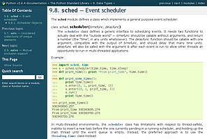
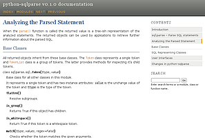
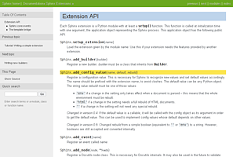

.. highlightlang:: python

.. HTML theming support
   ====================

HTMLテーマのサポート
====================

.. versionadded:: 0.6

.. Sphinx supports changing the appearance of its HTML output via *themes*.  A
   theme is a collection of HTML templates, stylesheet(s) and other static files.
   Additionally, it has a configuration file which specifies from which theme to
   inherit, which highlighting style to use, and what options exist for customizing
   the theme's look and feel.

Sphinxは *テーマ* を使って出力したHTMLの見た目を変更する機能をサポートしています。テーマというのは、HTMLのテンプレート、スタイルシート、およびその他の静的なファイル類を集めたものです。これに加えて、どのテーマから継承するか、どのようなハイライトのスタイルを使用するか、テーマのルックアンドフィールをカスタマイズするためにどのようなオプションがあるのか、といったことが書かれている設定ファイルがあります。

.. Themes are meant to be project-unaware, so they can be used for different
   projects without change.

テーマというのは特定のプロジェクトに依存しないものです。そのため、他のプロジェクトに適用する際に変更する必要はありません。

.. Using a theme
.. -------------

テーマを使用する
----------------

.. Using an existing theme is easy.  If the theme is builtin to Sphinx, you only
   need to set the :confval:`html_theme` config value.  With the
   :confval:`html_theme_options` config value you can set theme-specific options
   that change the look and feel.  For example, you could have the following in
   your :file:`conf.py`

既存のテーマを使用するのは簡単です。Sphinxに組み込みのテーマであれば、 :confval:`html_theme` という設定値をセットするだけです。 :confval:`html_theme_options` を使うと、そのテーマ特有の設定値を指定することができ、ルックアンドフィールを変更することができます。以下のように、 :file:`conf.py` に記述します::

    html_theme = "default"
    html_theme_options = {
        "rightsidebar": "true",
        "relbarbgcolor": "black"
    }

.. That would give you the default theme, but with a sidebar on the right side and
   a black background for the relation bar (the bar with the navigation links at
   the page's top and bottom).

この設定は、デフォルトのテーマを使用して、サイドバーを右に表示し、リレーションバー(ページの最上部と最下部の両方に表示される、ナビゲーションのリンクを持つバー)の背景色を黒に設定します。

.. If the theme does not come with Sphinx, it can be in two forms: either a
   directory (containing :file:`theme.conf` and other needed files), or a zip file
   with the same contents.  Either of them must be put where Sphinx can find it;
   for this there is the config value :confval:`html_theme_path`.  It gives a list
   of directories, relative to the directory containing :file:`conf.py`, that can
   contain theme directories or zip files.  For example, if you have a theme in the
   file :file:`blue.zip`, you can put it right in the directory containing
   :file:`conf.py` and use this configuration

Sphinxに組み込まれていないテーマを利用する方法は2通りの方法があります。 `theme.conf` とその他の必要なファイルの入ったディレクトリで指定する方法と、同様のファイルが入っているzipファイルを指定する方法です。どちらを使用するにしても、Sphinxから見つけられるように、 :confval:`html_theme_path` の設定を行う必要があります。この設定には、ディレクトリやzipファイルのテーマが入っているディレクトリのリストを設定します。パスは :file:`conf.py` からの相対パスで設定します。例えば、 :file:`conf.py` と同じディレクトリにある :file:`blue.zip` というファイルを設定するとしたら、以下のように設定します::

    html_theme = "blue"
    html_theme_path = ["."]

.. _builtin-themes:

組み込みテーマ
--------------

.. Builtin themes
   --------------

.. cssclass:: right

.. +--------------------+--------------------+
   | **Theme overview** |                    |
   +--------------------+--------------------+
   | |default|          | |sphinxdoc|        |
   |                    |                    |
   | *default*          | *sphinxdoc*        |
   +--------------------+--------------------+
   | |scrolls|          | |agogo|            |
   |                    |                    |
   | *scrolls*          | *agogo*            |
   +--------------------+--------------------+
   | |traditional|      | |nature|           |
   |                    |                    |
   | *traditional*      | *nature*           |
   +--------------------+--------------------+
   | |haiku|            |                    |
   |                    |                    |
   | *haiku*            |                    |
   +--------------------+--------------------+

+--------------------+--------------------+
| **テーマ一覧**     |                    |
+--------------------+--------------------+
| |default|          | |sphinxdoc|        |
|                    |                    |
| *default*          | *sphinxdoc*        |
+--------------------+--------------------+
| |scrolls|          | |agogo|            |
|                    |                    |
| *scrolls*          | *agogo*            |
+--------------------+--------------------+
| |traditional|      | |nature|           |
|                    |                    |
| *traditional*      | *nature*           |
+--------------------+--------------------+
| |haiku|            |                    |
|                    |                    |
| *haiku*            |                    |
+--------------------+--------------------+

.. |sphinxdoc|   image:: themes/sphinxdoc.png
.. |scrolls|     image:: themes/scrolls.png

.. |traditional| image:: themes/traditional.png

.. |haiku|       image:: themes/haiku.png

.. Sphinx comes with a selection of themes to choose from.

Sphinxではテーマを選択することができます。

.. These themes are:

テーマには次のようなものがあります。

.. * **basic** -- This is a basically unstyled layout used as the base for the
     other themes, and usable as the base for custom themes as
     well.  The HTML contains all important elements like sidebar and relation bar.
     There is one option (which is inherited by other themes):

     - **nosidebar** (true or false): Don't include the sidebar.  Defaults to
       false.

* **basic** -- 他のテーマのベースとして使用されているテーマです。基本的にレイアウトなどは設定されていません。これはカスタムテーマを作成するのに使用することができます。このHTMLには、サイドバーやリレーションバーなどの重要な要素はすべて含まれています。このテーマは一つのオプションを持っています。このオプションは他のテーマにも継承されます。

  - **nosidebar** (true / false): サイドバーが含まれなくなります。デフォルトは false です。

.. * **default** -- This is the default theme, which looks like `the Python
     documentation <http://docs.python.org/>`_.  It can be customized via these
     options:

     - **rightsidebar** (true or false): Put the sidebar on the right side.
       Defaults to false.

     - **stickysidebar** (true or false): Make the sidebar "fixed" so that it
       doesn't scroll out of view for long body content.  This may not work well
       with all browsers.  Defaults to false.

     - **collapsiblesidebar** (true or false): Add an *experimental* JavaScript
       snippet that makes the sidebar collapsible via a button on its side.
       *Doesn't work together with "rightsidebar" or "stickysidebar".* Defaults to
       false.

     - **externalrefs** (true or false): Display external links differently from
       internal links.  Defaults to false.

     There are also various color and font options that can change the color scheme
     without having to write a custom stylesheet:

     - **footerbgcolor** (CSS color): Background color for the footer line.
     - **footertextcolor** (CSS color): Text color for the footer line.
     - **sidebarbgcolor** (CSS color): Background color for the sidebar.
     - **sidebartextcolor** (CSS color): Text color for the sidebar.
     - **sidebarlinkcolor** (CSS color): Link color for the sidebar.
     - **relbarbgcolor** (CSS color): Background color for the relation bar.
     - **relbartextcolor** (CSS color): Text color for the relation bar.
     - **relbarlinkcolor** (CSS color): Link color for the relation bar.
     - **bgcolor** (CSS color): Body background color.
     - **textcolor** (CSS color): Body text color.
     - **linkcolor** (CSS color): Body link color.
     - **visitedlinkcolor** (CSS color): Body color for visited links.
     - **headbgcolor** (CSS color): Background color for headings.
     - **headtextcolor** (CSS color): Text color for headings.
     - **headlinkcolor** (CSS color): Link color for headings.
     - **codebgcolor** (CSS color): Background color for code blocks.
     - **codetextcolor** (CSS color): Default text color for code blocks, if not
       set differently by the highlighting style.
     - **bodyfont** (CSS font-family): Font for normal text.
     - **headfont** (CSS font-family): Font for headings.

* **default** -- `Pythonのドキュメント <http://docs.python.org/>`_ とよく似たデフォルトのテーマです。以下のようなカスタマイズ用オプションを持っています:

  - **rightsidebar** (true / false): サイドバーを右側に表示します。デフォルトは false です。

  - **stickysidebar** (true / false): サイドバーを画面上に "固定" し、本体の長いコンテンツを見ているときでもスクロールしなくなります。この機能はすべてのブラウザでうまく動作するわけではありません。デフォルトは false です。

  - **collapsiblesidebar** (true / false): サイドバーの横に、サイドバーを折りたためるようにする、 **実験的な** JavaScriptを追加します。 **これは"rightsidebar"や"stickysidebar"と一緒には動作しません。** デフォルトはfalseです。

  - **externalrefs** (true / false): 外部リンクを、内部リンクと異なる表示にします。デフォルトはflaseです。

  カスタムのスタイルシートを作成しなくても、カラースキームを変更できるように、数多くの色、フォントに関するオプションを持っています。

  - **footerbgcolor** (CSSカラー): フッターの背景色です。
  - **footertextcolor** (CSSカラー): フッターのテキストカラーです。
  - **sidebarbgcolor** (CSSカラー): サイドバーの背景色です。
  - **sidebartextcolor** (CSSカラー): サイドバーのテキストカラーです。
  - **sidebarlinkcolor** (CSSカラー): サイドバーのリンクの色です。
  - **relbarbgcolor** (CSSカラー): リレーションバーの背景色です。
  - **relbartextcolor** (CSSカラー): リレーションバーのテキストカラーです。
  - **relbarlinkcolor** (CSSカラー): リレーションバーのリンクの色です。
  - **bgcolor** (CSSカラー): Bodyの背景色です。
  - **textcolor** (CSSカラー): Bodyのテキストカラーです。
  - **linkcolor** (CSSカラー): Bodyのリンクのカラーです。
  - **visitedlinkcolor** (CSSカラー): 訪れたリンクのカラーです。
  - **headbgcolor** (CSSカラー): 見出しの背景色です。
  - **headtextcolor** (CSSカラー): 見出しのテキストカラーです。
  - **headlinkcolor** (CSSカラー): 見出しのリンクの色です。
  - **codebgcolor** (CSSカラー): コードブロックの背景色です。
  - **codetextcolor** (CSSカラー): ハイライトスタイルを設定していない場合に使用される、コードブロックのデフォルトのテキストカラーです。

.. * **sphinxdoc** -- The theme used for this documentation.  It features a sidebar
     on the right side.  There are currently no options beyond *nosidebar*.

* **sphinxdoc** -- このドキュメントで使用されているテーマです。このテーマではサイドバーが右側に表示されます。このテーマには *nosidebar* 以外のオプションはありません。

.. * **traditional** -- A theme resembling the old Python documentation.  There are
     currently no options beyond *nosidebar*.

.. * **scrolls** -- A more lightweight theme, based on `the Jinja documentation
     <http://jinja.pocoo.org/2/documentation/>`_.  The following color options are
     available:

* **scrolls** -- `テンプレートエンジンのJinjaのドキュメント <http://jinja.pocoo.org/2/documentation/>`_ で使用されている、軽量なテーマです。次のような色に関するオプションがあります。

  - **headerbordercolor**
  - **subheadlinecolor**
  - **linkcolor**
  - **visitedlinkcolor**
  - **admonitioncolor**

.. * **agogo** -- A theme created by Andi Albrecht.  The following options are
     supported:

     - **bodyfont** (CSS font family): Font for normal text.
     - **headerfont** (CSS font family): Font for headings.
     - **pagewidth** (CSS length): Width of the page content, default 70em.
     - **documentwidth** (CSS length): Width of the document (without sidebar),
       default 50em.
     - **sidebarwidth** (CSS length): Width of the sidebar, default 20em.
     - **bgcolor** (CSS color): Background color.
     - **headerbg** (CSS value for "background"): background for the header area,
         default a grayish gradient.
     - **footerbg** (CSS value for "background"): background for the footer area,
       default a light gray gradient.
     - **linkcolor** (CSS color): Body link color.
     - **headercolor1**, **headercolor2** (CSS color): colors for <h1> and <h2>
       headings.
     - **headerlinkcolor** (CSS color): Color for the backreference link in
       headings.
     - **textalign** (CSS *text-align* value): Text alignment for the body, default
       is ``justify``.

* **agogo** -- Andi Albrechtが作ったテーマです。次のようなオプションが提供されています:

  - **bodyfont** (CSSフォントファミリー): 通常のテキストのフォントです。
  - **headerfont** (CSSフォントファミリー): 見出しのフォントです。
  - **pagewidth** (CSS長さ): ページのコンテンツの幅です。デフォルトは 70em です。
  - **documentwidth** (CSS長さ): ドキュメントの幅です。デフォルトは 50em です。
  - **sidebarwidth** (CSS長さ): サイドバーの幅です。デフォルトは 20em です。
  - **bgcolor** (CSSカラー): 背景の色です。
  - **headerbg** (CSSの"background"の値): ヘッダーの領域の背景です。デフォルトはグラデーションのかかったグレーです。
  - **footerbg** (CSSの"background"の値): フッターの領域の背景です。デフォルトはグラデーションのかかった明るいグレーです。
  - **linkcolor** (CSSカラー): Bodyのリンクのカラーです。
  - **headcolor1**, **headercolor2** (CSSカラー): <h1>, <h2>の色です。
  - **headlinkcolor** (CSSカラー): 見出しの逆参照のリンクの色です。
  - **textalign** (CSS *text-align* の値): Bodyのテキストの配置です。デフォルトは ``justify`` です。

.. * **nature** -- A greenish theme.  There are currently no options beyond
     *nosidebar*.

* **nature** -- 緑色のテーマです。現在は *nosidebar* 以外のオプションはありません。

.. * **haiku** -- A theme without sidebar inspired by the `Haiku OS user guide
     <http://www.haiku-os.org/docs/userguide/en/contents.html>`_.  The following
     options are supported:

     - **full_logo** (true or false, default false): If this is true, the header
       will only show the :confval:`html_logo`.  Use this for large logos.  If this
       is false, the logo (if present) will be shown floating right, and the
       documentation title will be put in the header.
     - **textcolor**, **headingcolor**, **linkcolor**, **visitedlinkcolor**,
       **hoverlinkcolor** (CSS colors): Colors for various body elements.

* **haiku** -- `Haiku OS user guide <http://www.haiku-os.org/docs/userguide/en/contents.html>`_ にインスパイアされた、サイドバーのないテーマです。次のようなオプションが提供されています:

  - **full_logo** (True/False デフォルトはFalse): もしTrueの場合は、ヘッダーには :confval:`html_logo` だけが表示されます。大きなロゴを使用するときに設定して下さい。Falseが設定されると、ロゴはフローティングで右寄せに表示され(あれば)、ドキュメントタイトルがヘッダに表示されます。
  - **textcolor**, **headingcolor**, **linkcolor**, **visitedlinkcolor**,
    **hoverlinkcolor** (CSS カラー): それぞれの要素の色。

* **traditional** -- 古いPythonのドキュメントに似たテーマです。 *nosidebar* 以外のオプションはありません。

.. * **epub** -- A theme for the epub builder.  There are currently no options.
     This theme tries to save visual space which is a sparse resource on ebook
     readers.

* **epub** -- epubビルダーのためのテーマです。現在はオプションはありません。電子ブックビューア用に、ビジュアル要素の空間をなるべく少なくしたテーマです。

.. Creating themes
   ---------------

テーマを作成する
----------------

.. As said, themes are either a directory or a zipfile (whose name is the theme
   name), containing the following:

すでに説明している通り、テーマは以下のファイルを持つディレクトリかzipファイルです。ディレクトリ名かzipファイルの名前がテーマ名になります:

.. * A :file:`theme.conf` file, see below.
   * HTML templates, if needed.
   * A ``static/`` directory containing any static files that will be copied to the
     output statid directory on build.  These can be images, styles, script files.

* :file:`theme.conf` ファイル
* HTMLテンプレート(必要に応じて)
* ビルド時に出力のディレクトリにコピーされる静的ファイルを含む ``static/`` ディレクトリ。画像、スタイルシート、スクリプトファイルなどです。

.. The :file:`theme.conf` file is in INI format [1]_ (readable by the standard
   Python :mod:`ConfigParser` module) and has the following structure:

:file:`theme.conf` ファイルは Pythonの標準ライブラリの :mod:`ConfigParser` モジュールで読み込み可能な INIフォーマット [1]_ で記述します。以下のような構造になっています:

.. sourcecode:: ini

    [theme]
    inherit = 継承元のテーマ
    stylesheet = メインのCSS名
    pygments_style = スタイル名

    [options]
    変数 = デフォルト値

.. 
   [theme]
   inherit = base theme
   stylesheet = main CSS name
   pygments_style = stylename

   [options]
   variable = default value

.. * The **inherit** setting gives the name of a "base theme", or ``none``.  The
     base theme will be used to locate missing templates (most themes will not have
     to supply most templates if they use ``basic`` as the base theme), its options
     will be inherited, and all of its static files will be used as well.

**inherit** には、 "継承元のテーマ" もしくは ``none`` を指定します。もし見つからないテンプレートがあれば、継承元のテーマのテンプレートが使用されるようになります。ほとんどのテーマでは、 ``basic`` のテーマで使用されているのと同じように使用するのであれば、テンプレートをすべて提供する必要はありません。同様に、オプション、すべての静的なファイルも継承されます。

.. * The **stylesheet** setting gives the name of a CSS file which will be
     referenced in the HTML header.  If you need more than one CSS file, either
     include one from the other via CSS' ``@import``, or use a custom HTML template
     that adds ``<link rel="stylesheet">`` tags as necessary.  Setting the
     :confval:`html_style` config value will override this setting.

* **stylesheet** にはHTMLのヘッダから参照される、CSSファイルの名前を設定します。CSSファイルを一つ以上提供したい場合には、CSSの ``@import`` を使用して他のCSSをインクルードするか、必要なだけ ``<link rel="stylesheet">`` タグを追加する、カスタムのHTMLテンプレートを使用します。

.. * The **pygments_style** setting gives the name of a Pygments style to use for
     highlighting.  This can be overridden by the user in the
     :confval:`pygments_style` config value.

* **pygments_style** には、ハイライトに使用する、Pygmentsのスタイルの名前を設定します。この設定は、コンフィグ値の :confval:`pygments_style` を使用することで、上書きすることができます。

.. * The **options** section contains pairs of variable names and default values.
     These options can be overridden by the user in :confval:`html_theme_options`
     and are accessible from all templates as ``theme_<name>``.

* **options** セクションには変数名と、デフォルト値のペアを記述していきます。これらのオプションは、 :confval:`html_theme_options` を設定することで、ユーザ側で上書きすることができます。また、すべてのテンプレートからは、 ``theme_<名前>`` として、この設定値にアクセスすることができます。

.. Templating
   ~~~~~~~~~~

テンプレート
~~~~~~~~~~~~

.. The :doc:`guide to templating <templating>` is helpful if you want to write your
   own templates.  What is important to keep in mind is the order in which Sphinx
   searches for templates:

もし自分でテンプレートを書こうと思っている場合には、 :doc:`テンプレートガイド <templating>` を読むと参考になるでしょう。テンプレートに関して知っておくべきことは、Sphinxがテンプレートを探索する順序です:

.. * First, in the user's ``templates_path`` directories.
   * Then, in the selected theme.
   * Then, in its base theme, its base's base theme, etc.

* 最初は、ユーザの ``templates_path`` ディレクトリ
* その次は、選択されたテーマ内
* それから先は、テーマの継承元のテーマを順に探索

.. When extending a template in the base theme with the same name, use the theme
   name as an explicit directory: ````.  From a
   user ``templates_path`` template, you can still use the "exclamation mark"
   syntax as described in the templating document.

継承元のテーマに含まれるテンプレートと同名のテンプレートを作成して、拡張する場合には、 ```` という風にテーマ名をディレクトリとして明示することで行うことができます。ユーザの ``templates_path`` の中のテンプレートでも、 "エクスクラメーションマーク(!)" のシンタックスを使用して、テンプレートのドキュメント内であると指定することもできます。

.. Static templates
   ~~~~~~~~~~~~~~~~

静的テンプレート
~~~~~~~~~~~~~~~~

.. Since theme options are meant for the user to configure a theme more easily,
   without having to write a custom stylesheet, it is necessary to be able to
   template static files as well as HTML files.  Therefore, Sphinx supports
   so-called "static templates", like this:

テーマオプションを使用すると、ユーザがカスタムのスタイルシートを書く必要もなく、テーマを簡単にカスタマイズできるようになります。これはHTMLファイルと同じように、テンプレート静的ファイルでも行うことができます。Sphinxはこのために、"静的テンプレート"と呼ばれるものをサポートしています。

.. If the name of a file in the ``static/`` directory of a theme (or in the user's
   static path, for that matter) ends with ``_t``, it will be processed by the
   template engine.  The ``_t`` will be left from the final file name.  For
   example, the *default* theme has a file ``static/default.css_t`` which uses
   templating to put the color options into the stylesheet.  When a documentation
   is built with the default theme, the output directory will contain a
   ``_static/default.css`` file where all template tags have been processed.

もし、テーマの中の ``static/`` ディレクトリ(もしくはユーザの静的ファイルパス)の中に、末尾が ``_t`` のファイルがあったとすると、そのファイルはテンプレートエンジンによって処理されます。 ``_t`` は最終的なファイル名からは除外されます。例えば、 *default* テーマは ``static/default.css_t`` というファイルを持っていますが、これは色のオプションを持ったスタイルシートのテンプレートです。ドキュメントがビルドされる時に、すべてのテンプレートタグが処理されて、色のオプションがスタイルシートに書き込まれて、出力ディレクトリには ``_static/default.css`` ファイルとして出力されます。

.. .. [1] It is not an executable Python file, as opposed to :file:`conf.py`,
          because that would pose an unnecessary security risk if themes are
          shared.

.. [1] これは :file:`conf.py` とは異なり、実行可能はPythonファイルではありません。これは、テーマが共有されても、不必要なセキュリティのリスクを抱えないようにするために、このようになっています。

.. .. gscommentform::
